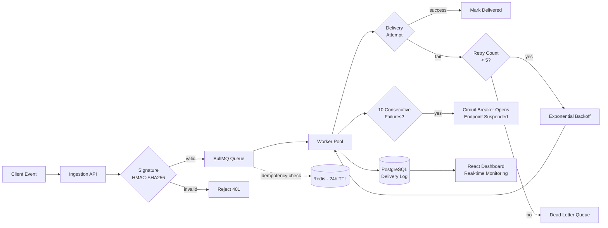

<div align="center">


<a href="https://www.linkedin.com/in/vaibhavbhardwaj2810/">
  
</a>

<br/><br/>

<p>
  <a href="mailto:bhardwajvaibhav0210@gmail.com"></a>
  <a href="https://www.linkedin.com/in/vaibhavbhardwaj2810/"></a>
  <a href="https://github.com/VaibhavXBhardwaj"></a>
  
</p>


&nbsp;

&nbsp;


</div>

<br/>

<div align="center">

**[About](#-about-me) · [Principles](#-how-i-engineer) · [Stack](#-tech-stack) · [Architecture Sample](#-system-design-sample) · [Projects](#%EF%B8%8F-featured-engineering-work) · [Experience](#-experience) · [Education](#-education) · [Achievements](#-certifications--achievements)**

</div>

---

## ⚡ About Me

```txt
const vaibhav = {
    role: "Backend Engineer / Cloud & Distributed Systems",
    education: "B.Tech CSE, SRM Institute of Science and Technology (2023–2027)",
    location: "Delhi, India — open to relocation",
    currentlyDoing: "Migrating a healthcare AI platform from AWS to self-managed Kubernetes on UpCloud",
    philosophy: "A system that hasn't failed yet just hasn't been tested yet — design for the failure, not the happy path",
    coreInterests: [
        "fault-tolerant distributed systems",
        "queue-based architectures & retry semantics",
        "API security, RBAC, and access control",
        "cloud infra & GitOps workflows",
        "LLM-integrated backend pipelines"
    ],
    currentlySeeking: "Backend / Cloud Engineering roles — 2027 grad, interview-ready now"
};
```

I'm a Computer Science undergraduate who spends most of his time in the unglamorous parts of backend engineering — retry strategies, dead-letter queues, idempotency keys, rate limiters, the stuff nobody notices until it's missing. I'd rather ship something boring that doesn't page anyone at 3 AM than something flashy that does.

Over the last year that's meant building distributed systems from scratch (webhook delivery engines, job schedulers, queue-based processors), securing APIs with proper auth and RBAC, and — most recently — real infrastructure work: migrating a live healthcare AI platform off AWS onto a self-managed Kubernetes cluster, with GitOps, ingress, cert management, and full observability wired in.

I also treat LLMs as a backend problem, not a novelty — job-failure summarization pipelines, DAG-based dependency resolution with AI-generated insights, natural-language search over structured data. The interesting part isn't the model call, it's everything you build around it to make it production-safe.

---

## 🎯 How I Engineer

<table>
<tr>
<td width="33%" valign="top">

**Design for failure first**
<br/>
Every system I build starts with the question "what happens when this dependency is down" — not "does this work when everything's fine."

</td>
<td width="33%" valign="top">

**Idempotency is non-negotiable**
<br/>
Retries and at-least-once delivery are cheap. Duplicate side effects are expensive. I default to idempotency keys on anything that mutates state.

</td>
<td width="33%" valign="top">

**Observability isn't optional**
<br/>
If I can't see it in Grafana, I don't trust that it's working. Metrics and structured logs go in at build time, not after the first incident.

</td>
</tr>
</table>

---

## 🧠 Tech Stack

<div align="center">

**Languages**
<br/>


<br/>

**Backend & APIs**
<br/>


<br/>

**Cloud & Infra**
<br/>


<br/>

**Frontend & Tooling**
<br/>


<br/>

**AI / LLM Integration**
<br/>


</div>

<br/>

**Proficiency breakdown**

| Tier | Skills |
|---|---|
| 🟢 **Core — daily driver** | Node.js, Express, TypeScript, PostgreSQL, Redis, REST API design, JWT/RBAC, Docker |
| 🟡 **Proficient — shipped production work** | AWS (EC2, S3, SQS, RDS, IAM), Kubernetes, Helm, ArgoCD/GitOps, Prometheus/Grafana, Next.js, React |
| 🔵 **Working knowledge — actively building with** | Groq/Llama & LLM pipeline integration, pgvector, FastAPI, Nginx/Cert-Manager, GraphQL |

---

## 🖥️ System Design Sample

A simplified view of the **Distributed Webhook Delivery Engine** — the project I'd walk any interviewer through first.



**Why it's built this way:** the ingestion API never talks directly to a downstream endpoint — everything goes through a queue so a slow or dead consumer can't back-pressure the whole system. The circuit breaker exists so one broken customer endpoint can't burn through worker capacity meant for everyone else. Idempotency checks live in Redis specifically because they need to be fast and short-lived — a 24h TTL is enough to absorb retry storms without growing unbounded.

---

## 🏗️ Featured Engineering Work

<table>
<tr>
<td width="50%" valign="top">

### 🔗 Distributed Webhook Delivery Engine
**Node.js · TypeScript · PostgreSQL · Redis · Docker · AWS EC2**

- Async fan-out using BullMQ + Redis
- HMAC-SHA256 signing for webhook verification
- Exponential backoff across 5 retries, circuit breaker after 10 consecutive failures
- Zero event loss via Dead Letter Queue + Redis idempotency middleware (24h TTL)
- Multi-layer rate limiting (100 req/15min global, 60 events/min per API key)
- 15+ REST APIs, Dockerized on EC2, zero-downtime CI/CD via GitHub Actions
- React dashboard for real-time delivery monitoring

`Node.js` `TypeScript` `PostgreSQL` `Redis` `BullMQ` `Docker` `AWS EC2` `React`

</td>
<td width="50%" valign="top">

### 🚀 Shipped — Founder & Developer
**Next.js · Prisma · PostgreSQL · Groq (Llama) · Clerk · Vercel**

- 4-signal detection engine: live URL, README scan, CI/CD detection, GitHub Pages
- Automated crawler with GitHub API token rotation, hourly cron
- Indexed 3,000+ developers within 2 weeks of launch
- AI-powered natural-language recruiter search via Groq/Llama
- Landing page + chat-style search UI, built and iterated solo
- Organic user acquisition via Reddit, LinkedIn, Twitter, Peerlist

`Next.js` `TypeScript` `PostgreSQL` `Upstash Redis` `Groq` `Clerk`

</td>
</tr>
<tr>
<td width="50%" valign="top">

### ⚙️ Distributed Job Processing System
**Node.js · AWS SQS · PostgreSQL · Docker · EC2**

- Queue-driven architecture handling 500+ concurrent jobs
- AWS SQS integration for job distribution
- Retry-based fault tolerance and result retrieval workflows
- Deployed on EC2 with automated CI/CD

`Node.js` `AWS SQS` `PostgreSQL` `Docker` `EC2` `GitHub Actions`

</td>
<td width="50%" valign="top">

### 🔐 API Reliability & Access Control System
**Node.js · Express · PostgreSQL · Docker**

- JWT authentication with role-based access control (RBAC)
- Protected routes with centralized validation and error handling
- Structured logging for observability
- Containerized, documented via Swagger/OpenAPI

`Node.js` `Express.js` `PostgreSQL` `Docker` `Swagger/OpenAPI`

</td>
</tr>
</table>

<details>
<summary><b>📂 More projects — click to expand</b></summary>
<br/>

<table>
<tr>
<td width="50%" valign="top">

**🧵 Distributed Job Scheduling Platform (Codity.AI)**
<br/>
Built under a tight deadline: atomic job claiming, retry strategies, DLQ handling, RBAC, DAG-based job dependencies, and AI-generated failure summaries via Groq/Llama.
<br/>
`Node.js` `Redis` `PostgreSQL` `Groq`

</td>
<td width="50%" valign="top">

**✅ ValidFlow (Xeno)**
<br/>
Browser-based CSV validation SaaS tool — Next.js + Tailwind frontend built to a self-imposed "SaaS-level" quality bar, deployed on Vercel.
<br/>
`Next.js` `Tailwind` `TypeScript`

</td>
</tr>
<tr>
<td width="50%" valign="top">

**📊 AdPulse — Multi-tenant SaaS Backend**
<br/>
E-commerce intelligence backend with RBAC, API key auth, rate limiting, tenant isolation, and time-series price aggregation using pgvector.
<br/>
`Node.js` `PostgreSQL` `pgvector` `Redis` `Prisma` `Docker`

</td>
<td width="50%" valign="top">

**📱 SocialPulse**
<br/>
Full-stack social post application with a deliberate dark editorial design, image handling, and secure auth.
<br/>
`Express` `MongoDB` `Cloudinary` `JWT` `React`

</td>
</tr>
<tr>
<td width="50%" valign="top">

**🔄 VectorShift (YC S23) Pipeline Editor**
<br/>
ReactFlow-based visual pipeline editor — BaseNode abstraction, 5 node types, dynamic Text-node logic, and a FastAPI backend for DAG cycle detection.
<br/>
`React` `ReactFlow` `FastAPI` `Python`

</td>
<td width="50%" valign="top">

**📅 Dateify — Appointment Scheduler**
<br/>
Full-stack scheduling platform with PostgreSQL schema constraints preventing double bookings and secure auth flows.
<br/>
`Node.js` `Express` `PostgreSQL` `Prisma` `Tailwind`

</td>
</tr>
</table>

**🏁 Tata Technologies InnoVent 2025 Hackathon** — Solo submission combining predictive coding and epistemic uncertainty quantification for an automotive AI concept, delivered as an 11-slide technical deck.

**📄 IEEE Publication** — Co-authored an LLM-enhanced campus recruitment framework, published at ICMCSI 2026 (DOI: 10.1109/ICMCSI67283.2026.11412711).

</details>

---

## 💼 Experience

<table>
<tr>
<td width="50%" valign="top">

### Cloud Migration Intern
**Nightingale Heart Project** · Germany (Remote)
`Apr 2025 – Present`

- Migrating 7 RDS databases and S3 object storage to UpCloud, standing up a Kubernetes cluster with ArgoCD/GitOps, Helm, Nginx ingress, and Cert-Manager
- Wired Prometheus + Grafana observability into a HIPAA-adjacent healthcare AI platform
- Authored migration runbooks and infra topology docs, cutting contributor onboarding time
- Handled EC2 deployment end-to-end — SSH provisioning, rsync-based frontend syncing, cross-team API coordination

`AWS EC2` `S3` `RDS` `UpCloud` `Kubernetes` `Prometheus` `Grafana` `Docker` `Nginx`

</td>
<td width="50%" valign="top">

### Full Stack Developer Intern
**Codlyn Softwares** · Delhi, India
`Dec 2025 – Feb 2026`

- Shipped a customer invoicing module end-to-end (schema, REST API, auth middleware, frontend), cutting manual processing time by 30%
- Optimized frontend asset delivery — 25% reduction in page load time, improved Core Web Vitals
- Implemented RBAC middleware and Zod validation across 12+ API routes, reducing invalid request errors in production

`Node.js` `Express.js` `JavaScript` `Tailwind CSS` `REST APIs`

</td>
</tr>
</table>

---

## 🎓 Education

**B.Tech, Computer Science and Engineering**
<br/>
SRM Institute of Science and Technology (SRMIST) — Ghaziabad, India
<br/>
`2023 – 2027` · CGPA: 7.5/10

---

## 🏆 Certifications & Achievements

- 🧩 **150+ LeetCode problems solved** — arrays, trees, graphs, DP, sliding window — following Neetcode 150
- ☁️ **Google Cloud Skill Badges** — cloud infrastructure, Kubernetes, serverless computing
- 🌍 **freeCodeCamp contributor** — verified PRs improving documentation and curriculum used by millions of developers
- 📄 **Published IEEE paper** — LLM-enhanced campus recruitment framework, ICMCSI 2026

---

<div align="center">

### Let's build something that doesn't go down at 3 AM.

📫 **bhardwajvaibhav0210@gmail.com** · Open to backend, cloud, and distributed-systems roles


</div>
